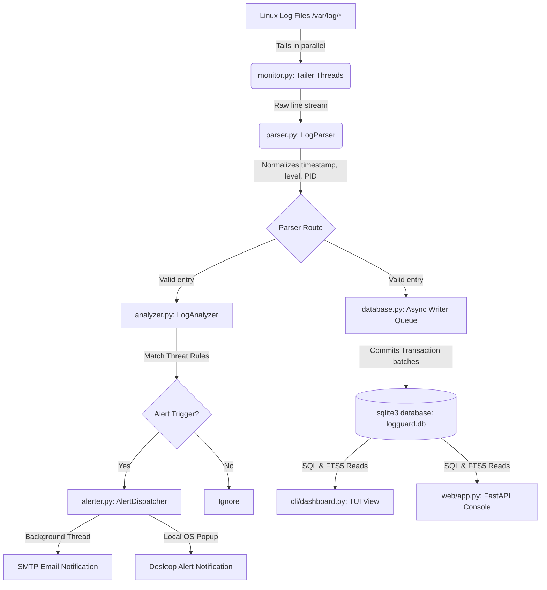

# Technical Architecture Guide: LogGuard

This document details the architectural design, database design, and statistical heuristics of **LogGuard**.

---

## 1. Linux Logging Architecture Overview

Linux systems record kernel activities, user authentications, and application states through standardized logging systems:

```
┌────────────────────────────────────────────────────────┐
│                   Linux Log Sources                    │
└───────────────────────────┬────────────────────────────┘
                            ▼
┌────────────────────────────────────────────────────────┐
│  syslogd / rsyslog / journald Logging Daemon Engine   │
└───────────────────────────┬────────────────────────────┘
                            ▼
┌───────────────────────────┼────────────────────────────┐
│                           │                            │
▼                           ▼                            ▼
/var/log/syslog       /var/log/auth.log            /var/log/kern.log
(Generic System)     (User Authentications)       (Kernel messages/OOM)
```

1.  **Syslog Daemon (`rsyslogd`)**: Receives events from standard sockets, routes them by facility and severity level, and appends them to text files.
2.  **Kernel Ring Buffer**: Exposes boot and hardware alerts to `dmesg`, which are then copied by `rsyslog` to `/var/log/kern.log`.
3.  **Systemd Journal (`journald`)**: Modern binary logging manager. Often configured to forward events to `syslog` or write text files to `/var/log/` for backward compatibility.
4.  **Log rotation (`logrotate`)**: Periodically compresses, archives, and moves log files (e.g. `auth.log` -> `auth.log.1` or truncates it in-place) to avoid storage exhaustion. LogGuard handles this rotation seamlessly.

---

## 2. LogGuard Architecture & Data Flow

LogGuard uses a decoupled pipeline to ingest, store, inspect, and alert on logs:



### Decoupled Execution Pipeline
1.  **Tailing & Rotation Watcher (`monitor.py`)**: Spawns monitoring threads for each target log. Checks sizes and inodes. Re-opens files instantly upon rotation or truncation.
2.  **Parsing & Normalization (`parser.py`)**: Resolves syslog timestamp formatting variations, extracts process identifiers, and extracts user/IP variables from security logs.
3.  **Database batching (`database.py`)**: To bypass SQLite concurrent write locks, log threads push records to a thread-safe Queue. A background thread flushes items in batches (e.g. 100 items or 1.0s window) inside unified SQL transactions.
4.  **Analysis Engine (`analyzer.py`)**: Performs real-time security auditing in a sliding temporal window.
5.  **Alert Dispatcher (`alerter.py`)**: Sends messages via SMTP or OS alerts using non-blocking background threads.

---

## 3. Database Layout & SQLite Tuning

LogGuard utilizes SQLite as a high-performance local database engine.

### Schema Details

```sql
-- Main Logs Table
CREATE TABLE logs (
    id INTEGER PRIMARY KEY AUTOINCREMENT,
    timestamp TEXT NOT NULL,       -- ISO Sortable format (YYYY-MM-DD HH:MM:SS)
    log_level TEXT NOT NULL,       -- INFO, WARNING, ERROR, CRITICAL, DEBUG
    source_file TEXT NOT NULL,     -- Logical file origin (Syslog, Auth, etc.)
    program TEXT NOT NULL,         -- Program name (sshd, systemd, etc.)
    pid INTEGER,                   -- Process identifier
    message TEXT NOT NULL,         -- Process message text
    raw_line TEXT NOT NULL         -- Full original raw log string
);

-- Indexing for rapid queries
CREATE INDEX idx_logs_timestamp ON logs(timestamp);
CREATE INDEX idx_logs_level ON logs(log_level);
CREATE INDEX idx_logs_program ON logs(program);
CREATE INDEX idx_logs_source ON logs(source_file);

-- Threat Alerts Table
CREATE TABLE alerts (
    id INTEGER PRIMARY KEY AUTOINCREMENT,
    timestamp TEXT NOT NULL,       -- Trigger time
    alert_type TEXT NOT NULL,      -- AUTH_BRUTE_FORCE, VOLUME_ANOMALY, etc.
    severity TEXT NOT NULL,        -- WARNING, CRITICAL
    message TEXT NOT NULL,         -- Formatted alert details
    resolved INTEGER DEFAULT 0     -- Resolution flag (0=Active, 1=Resolved)
);
CREATE INDEX idx_alerts_timestamp ON alerts(timestamp);

-- SQLite FTS5 Full-Text Search Virtual Table
CREATE VIRTUAL TABLE logs_fts USING fts5(
    message,
    content='logs',                -- Linked to main logs table
    content_rowid='id'
);
```

### FTS5 Update Sync Triggers
We keep the full-text indexes synchronized with the `logs` table using standard SQLite triggers, eliminating application code indexing overhead:

```sql
CREATE TRIGGER trg_logs_ai AFTER INSERT ON logs BEGIN
    INSERT INTO logs_fts(rowid, message) VALUES (new.id, new.message);
END;

CREATE TRIGGER trg_logs_ad AFTER DELETE ON logs BEGIN
    INSERT INTO logs_fts(logs_fts, rowid, message) VALUES('delete', old.id, old.message);
END;

CREATE TRIGGER trg_logs_au AFTER UPDATE ON logs BEGIN
    INSERT INTO logs_fts(logs_fts, rowid, message) VALUES('delete', old.id, old.message);
    INSERT INTO logs_fts(rowid, message) VALUES (new.id, new.message);
END;
```

### SQLite Performance Adjustments
1.  **WAL Journaling**: `PRAGMA journal_mode=WAL;` enables simultaneous read and write processes. Reader threads (Web / TUI dashboard) query the database without blocking the background ingestion writer thread.
2.  **Synchronous Normal**: `PRAGMA synchronous=NORMAL;` reduces disk write frequency, trading database safety against sudden OS level kernel failures for a 3-5x write throughput boost.
3.  **Memory cache sizing**: `PRAGMA cache_size=-10000;` configures a 10MB memory page pool cache, keeping indexes in RAM for fast search queries.

---

## 4. Threat Detection & Anomaly Heuristics

LogGuard runs real-time security rules to identify anomalies:

### A. SSH / Auth Brute Force Detection
-   **Algorithm**: Sliding Temporal Window count.
-   **Methodology**: Maintains a hash map `failed_auth_tracks` tracking failed access timestamps by IP address.
-   **Trigger**: If an IP records `N` attempts within `W` seconds (configured in `config.yaml`), it dispatches a `CRITICAL` threat alert.
-   **Reset**: Clears track history for that IP upon trigger to avoid event flood loops.

### B. Repeated Failures Deduplication
-   **Algorithm**: Structural Template similarity tracking.
-   **Methodology**: Sanitizes message bodies by replacing numeric values, IP addresses, and hex addresses with constants. Hashes the sanitized body.
-   **Trigger**: If an error pattern repeats more than `M` times within `T` seconds, it raises a warning.

### C. Traffic Volume Anomaly Engine
-   **Algorithm**: Statistical standard deviation thresholds.
-   **Methodology**: Monitors log frequency per process over a 60-second sliding window. Keeps track of historical averages and standard deviations using a running variance estimation.
-   **Trigger**: If current log counts exceed `Average + (3 * StandardDeviation)`, it flags a log traffic surge anomaly, identifying compromised or failing background services.
